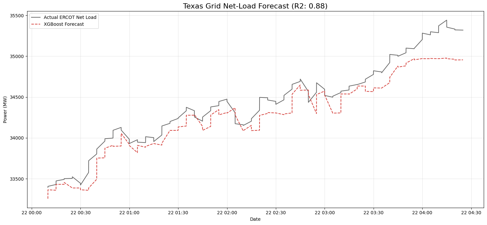

# Texas Grid (ERCOT) Net-Load Forecaster

## Overview
This project predicts the "net load" (total electricity demand minus wind and solar generation) for the Texas power grid (ERCOT). Accurately forecasting net load is critical for grid stability and ensuring non-renewable power plants are ramped up in time to meet demand.

## Features
* **Data Ingestion:** Fetches real-time and historical load/fuel-mix data using the `gridstatus` API.
* **Feature Engineering:** Creates 5-minute interval time-series data, integrating temporal features (hour, day, month) and historical lags (1-hour, 24-hour, and 1-week).
* **Machine Learning:** Utilizes an `XGBoost` regression model to predict future energy demands based on historical patterns and renewable generation data.

## Results
The model successfully identifies the daily peaks and valleys of Texas energy consumption. 
* **RMSE:** 181.85 MW
* **R2 Score:** 0.8774

## Tech Stack
* **Python**
* **Pandas / NumPy** (Data processing and temporal resampling)
* **XGBoost / Scikit-Learn** (Predictive modeling)
* **Matplotlib / Seaborn** (Data visualization)

## How to Run
1. Clone this repository.
2. Install the required packages: `pip install -r requirements.txt`
3. Run the script: `python forecast.py`
